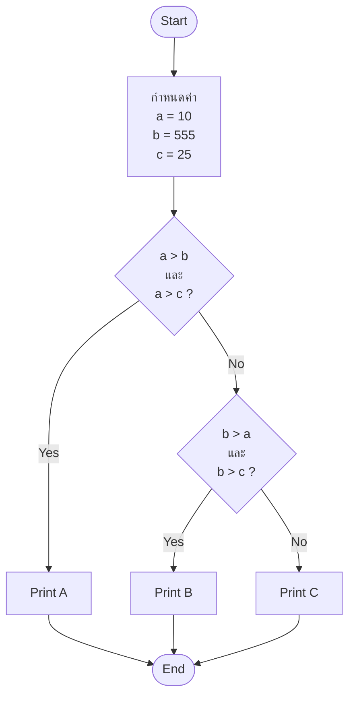

```mermaid
flowchart TD
    A([Start]) --> B[กำหนดค่า <br/>a = 10<br/>b = 555<br/>c = 25]
    B --> C{a > b<br/>และ<br/>a > c ?}
    C -- Yes --> D[Print A]
    C -- No --> E{b > a<br/>และ<br/>b > c ?}
    E -- Yes --> F[Print B]
    E -- No --> G[Print C]
    D --> H([End])
    F --> H
    G --> H
```
